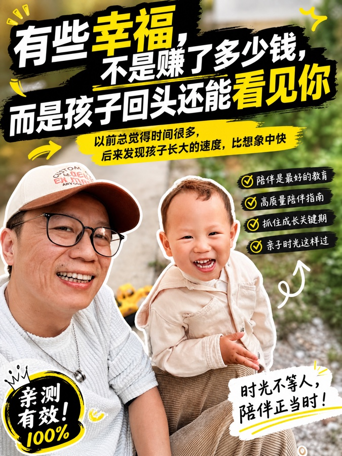
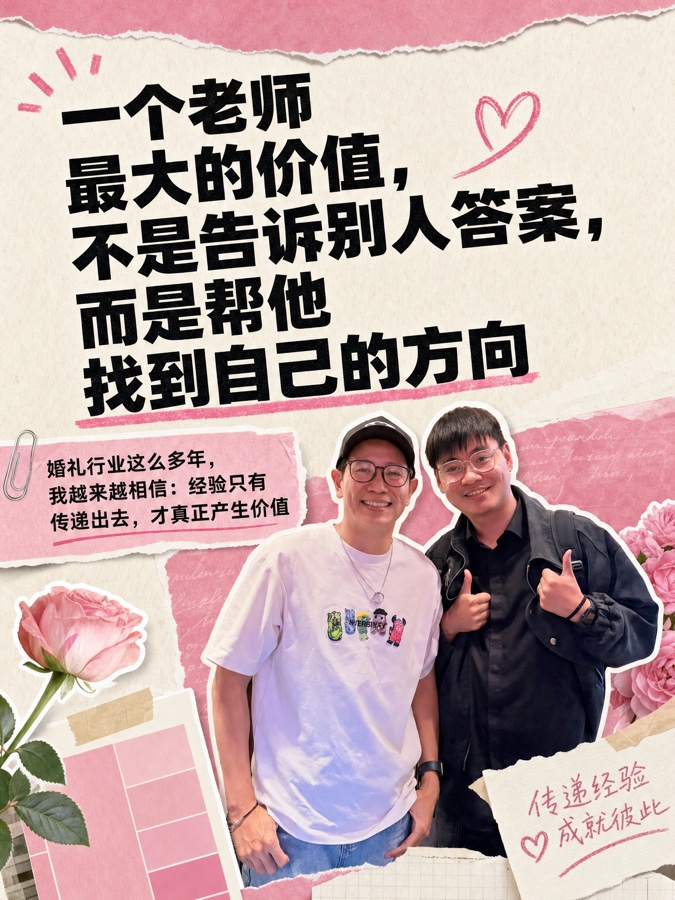
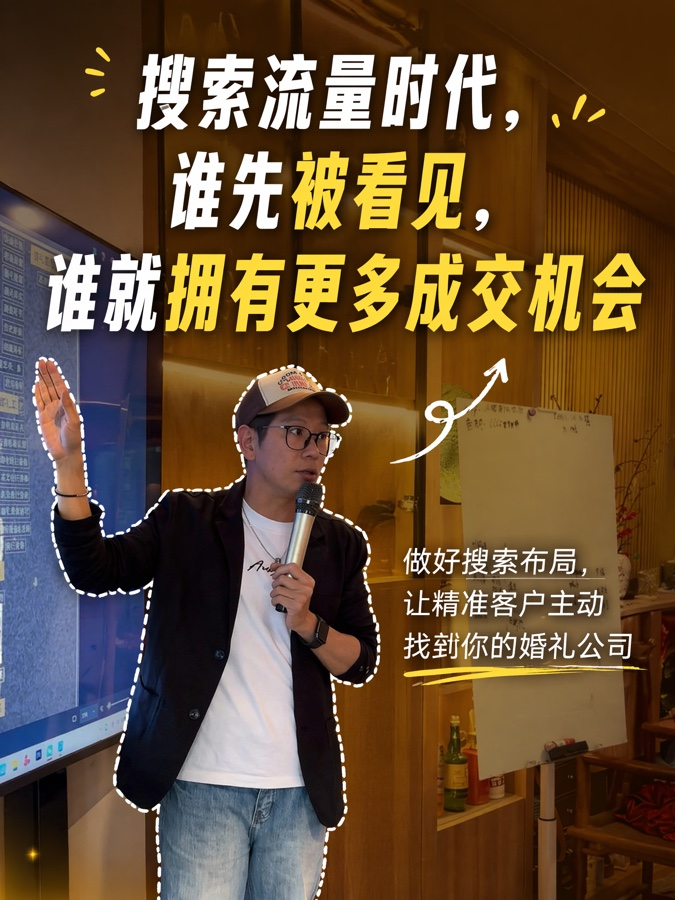
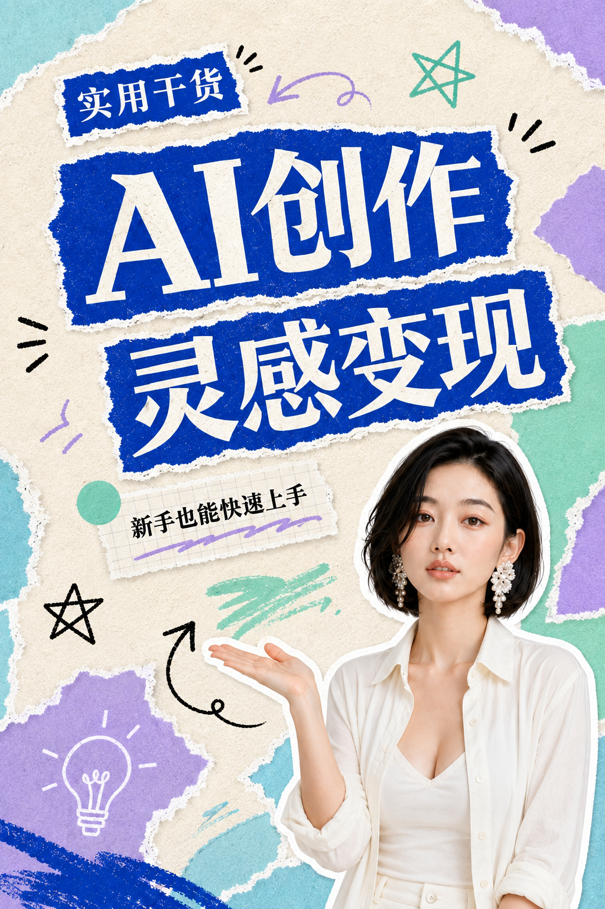
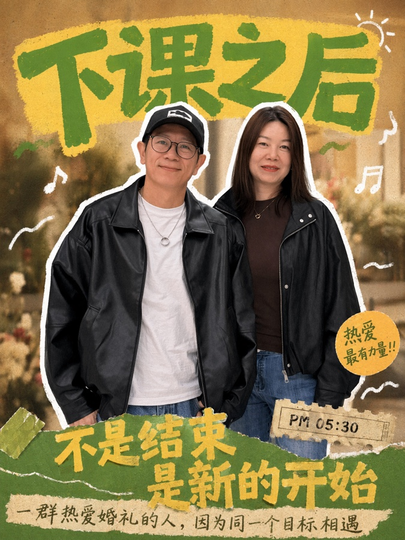
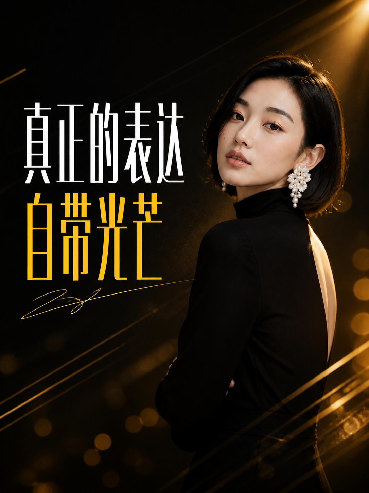
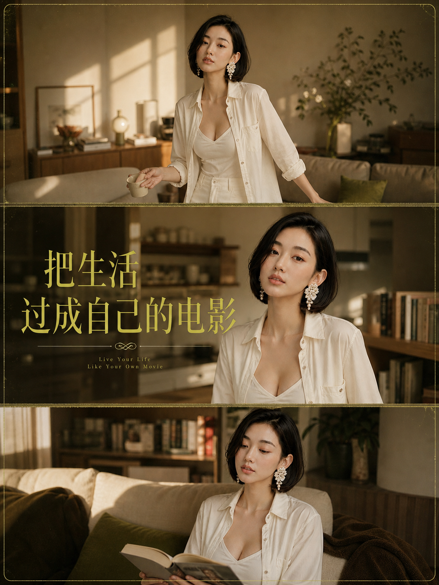

# 九种封面风格

所有参考图只用于选择字体、配色、版式、描边、拼贴和信息层级，不复制其中的人物、原文、品牌或具体场景。

## 风格速选

| 编号 | 风格 | 更适合 |
|---|---|---|
| 一 | 技能清单爆款 | 工具教学、课程卖点、入门教程 |
| 二 | 粉色杂志拼贴 | 个人品牌、女性成长、审美故事 |
| 三 | 搜索引导大字 | 搜索流量、账号运营、方法教学 |
| 四 | 黄色杂志教程 | 案例拆解、成长方法、知识内容 |
| 五 | 蓝绿撕纸教程 | AI工具、软件教程、效率方法 |
| 六 | 复古手写氛围 | 情绪、生活态度、个人表达 |
| 七 | 深色渐变风 | 老板思维、行业判断、强观点 |
| 八 | 黑金创作宣言 | 创作态度、行业表达、金句 |
| 九 | 电影感居家拼图 | 生活方式、日常记录、空间故事 |

选择风格时，展示下面九张本地参考图；如果当前界面无法直接预览，明确说明限制并给出对应名称，不假装用户已经看见。

1. 
2. 
3. 
4. 
5. 
6. 
7. 
8. 
9. 

## 一、技能清单爆款

- 适合：技能科普、工具教学、入门教程、课程卖点。
- 构图：人物半身居中或偏下；顶部放黄白超粗主标题；一侧放三条绿色勾选副标题。
- 字体：浅黄色或白色超粗黑体，粗黑描边；专有名词可做小标签。
- 装饰：问号、拼图、箭头、小贴纸，控制在三至五个。
- 附图：做成一至三张小卡片，位于人物旁边或手势指向处。
- 避免：极简留白、细字体、长段文字。

## 二、粉色杂志拼贴

- 适合：个人品牌、女性成长、审美、时尚、品牌故事。
- 构图：米白纸张背景；黑色巨型主标题占左上和中部；人物白边抠图位于右侧或右下。
- 字体：黑色超粗无衬线主标题；粉色手写体只做轻量强调。
- 装饰：撕纸、便签、粉色色卡、胶带、花朵、手绘爱心与星星。
- 副标题：放在黑色撕纸块、便签或小卡片上。
- 避免：绿色勾选清单、科技感背景、荧光撞色。

## 三、搜索引导大字

- 适合：搜索流量、账号运营、方法教学、结果导向主题。
- 构图：真实暖色背景；人物位于左下或中下，手势指向标题；主标题占上半部。
- 字体：白色与金黄色细长大字混排，保留清晰层级。
- 装饰：人物外围使用白色虚线轮廓；用虚线箭头连接人物手势与标题。
- 副标题：放在底部横条，白黄混排，字号明显小于主标题。
- 避免：大面积拼贴、复杂贴纸墙、人物遮挡标题。

## 四、黄色杂志教程

- 适合：教程、案例拆解、成长方法、杂志感知识内容。
- 构图：人物居中；超大黄色主标题在人物前后穿插；附图做成一至三张小杂志封面卡片。
- 字体：黄色粗体中文为主，可加入少量外文作背景装饰。
- 装饰：橙色横条、黑色撕纸块、小杂志卡片。
- 副标题：优先放在橙色横条或黑色撕纸块中。
- 避免：白色手写字铺满、柔和低对比配色。

## 五、蓝绿撕纸教程

- 适合：AI工具教学、软件教程、效率方法、知识科普、功能拆解。
- 构图：暖白纸张背景；钴蓝色撕纸承载巨型主标题；薄荷绿色撕纸承载关键词；人物白边抠图位于左下或右下，手势指向标题。
- 字体：白色大标题置于钴蓝撕纸上；黑色粗体字补充信息；关键词用薄荷绿色区块强调。
- 装饰：蓝绿不规则纸块、手绘箭头、星星、短线和涂鸦签名。
- 副标题：放在绿色撕纸、顶部小蓝标签或标题旁的短区域中。
- 避免：真实软件界面、平台数据、密集卡片、低对比细字、无关人物。

## 六、复古手写氛围

- 适合：音乐、情绪、生活态度、复古穿搭、个人表达。
- 构图：暖棕复古生活场景；人物白边抠图居中；标题环绕人物但不遮挡脸。
- 字体：绿色与黄色粗手写字分层组合，保留不规则笔触。
- 装饰：胶片颗粒、音乐符号、手绘波浪、时间标签。
- 副标题：放在底部黄色手写区或小型胶片标签中。
- 避免：纯白满屏手写字、相机参数顶栏、现代科技贴纸。

## 七、深色渐变风

- 适合：个人观点、老板思维、行业判断、强情绪金句。
- 构图：深灰、墨黑或深蓝渐变背景；人物居中下方或右下；标题位于人物后方或上方。
- 字体：超粗黑体或极简无衬线；允许金黄、橙红或高亮渐变字，配深色描边和阴影。
- 装饰：少量增长箭头、齿轮、光线或颗粒，不堆贴纸。
- 避免：低对比细字、过多信息卡片、虚假数据。

## 八、黑金创作宣言

- 适合：个人观点、行业表达、创作态度、强情绪金句。
- 构图：暖色夜景或深色光斑背景；人物侧颜位于右侧；左侧以黄白两色窄体巨字形成纵向视觉重心。
- 字体：高对比黄白超窄粗体，关键词放大叠排；外文只作为顶部和底部的小型装饰。
- 装饰：少量斜线、光斑、细体外文和手写签名字样。
- 避免：浅色纸张拼贴、绿色清单、人物居中证件照构图。

## 九、电影感居家拼图

- 适合：生活方式、日常记录、居家故事、空间故事。
- 构图：画面分成上中下三段横向电影镜头；同一人物在居家空间中以不同裁切呈现；主标题横跨中段。
- 字体：黄绿色衬线主标题配少量白色外文，保留电影海报式字距。
- 装饰：尖括号、花括号、井号、细体外文和少量分隔线。
- 避免：单人大头铺满、综艺粗黑描边字、密集贴纸。

## 共用验收

- 主标题只有一个第一注意力；其他元素只解释或强化它。
- 手机缩略图下一秒能读懂，不靠小字解释核心信息。
- 主图人物能认出是本人，附图不抢主图。
- 删除一个辅助元素后如果更清楚，就删除。

本风格库改编自刘坚伟的开源封面设计技能，许可证与来源记录在插件根目录的第三方声明中。
